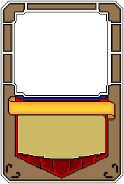
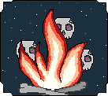
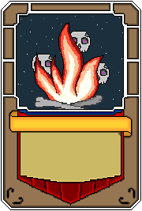
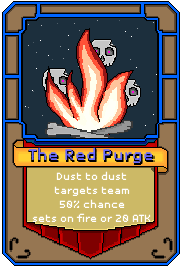

.. |folder| image:: assets/structure/folder.png
.. |file| image:: assets/structure/file.png

Cards
*****

File structure
--------------

|folder| set_name

    |file| draw.lua

    other stuff e.g:

    |file| image.png

    |folder| card_name

        |file| image.png

        |file| load.lua

* draw.lua

    This contains code to draw the cards of the same set, it is used together with load.lua to draw the card.

    **Example**::

     local _PACKAGE = getPackage(...)
     local image = love.graphics.newImage(_PACKAGE.."/".."image.png")
     local func
     local Shader = love.graphics.newShader("s/outline.glsl")
     local TitleF = love.graphics.newFont(uniBody,12)
     local TextF = love.graphics.newFont(uniBody,8)
     local largeFont = love.graphics.newFont(60)
     func = function(card)
        local CardColor = card.cColor or {105,105,255}
        local oldFont = love.graphics.getFont()

        local lg = love.graphics
        local rareCol = card.rarityCol
        local w,h = image:getDimensions()

        -- Corner crop for the beautiful coloring
        local stencil = function()
            local h = h - 2
            lg.polygon("fill",0,0, 13,0, 0,13 )
            lg.polygon("fill",w,0, w - 13,0, w,13)

            lg.polygon("fill",0,h, 13,h, 0,h - 12 )
            lg.polygon("fill",w,h, w - 14,h, w,h -14 )
        end

        -- coloring only the sides so crop needs to be applied here

        lg.setInvertedStencil(stencil)
            lg.setColor(rareCol)

        -- drawing a rectangle with rarity color.

        lg.rectangle("fill",1,1,w - 2,h - 2)
        lg.setColor(255,255,255)
        lg.setInvertedStencil()

        -- if its not an animation draw the image, otherwise draw the animation.

        if not card.activeAnim then
            lg.draw(card.image,20,16)
        else
            card.activeAnim:draw(19,16)
        end

        lg.draw(image,-1,-1)

        -- drawing of text happens here.
        lg.setFont(TitleF)
        -- sets new font.

        local text = card.name

        -- retrieves the card name

        local tw = TitleF:getWidth(text)
        local th = TitleF:getHeight()
        local w,h = 146,18

        lg.setShader(Shader)

        lg.push()
        lg.scale(1.01)
        love.graphics.printf(text,16 + w/2 - tw/2,146 + h/2 -th/2 - 3,tw)
        lg.pop()

        -- shader does some recoloring on the text to make it stand out a little.

        Shader:send("color",{0,0,0})
        lg.setShader()

        lg.setColor(CardColor)

        -- print the text again this time as overlay of the shaded text.

        love.graphics.printf(text,16 + w/2 - tw/2,146 + h/2 -th/2 - 3,tw)
        lg.setFont(TextF)
        local x,y = 26,168
        local w,h  = 127,42

        -- print the description in its appropriate box.

        local text = card.desc
        lg.setColor(255,255,255)
        love.graphics.printf(text,x,y,w,"center")
        lg.setFont(oldFont)
        lg.setColor(255,0,0)

        lg.setColor(255,255,255)

     end

     return func

* load.lua

    Load contains information required such as description,name and functions of the card.

    **Example**::

        local _PACKAGE = getPackageAlt(...)
        local image = love.graphics.newImage(_PACKAGE .."/image.png")
        local card = {
            name = "Healing",
            desc = "targets team \n heals [30%] of max hp each",
            cost = 10,
            rarity = 1, -- out of 10
            target = "team", -- team, none, single
            onUse = function(target,stack,item,area1,area2) -- Target is the target ::  stack: {team1, team2, finished} :: item is the item that you can draw with, it will allow you to draw things to screen
                for i,v in ipairs(target) do
                    v:applyDamage((v.maxHp/100)*30,"heal")
                end
                stack[4] = true
            end,
            externalUse = function()
                for i,v in ipairs(playersMobs) do
                    local hp = v.info.hp
                    local maxHp = v.info.maxHp
                    v.info.hp = hp + (maxHp/100)*30
                    if v.info.hp > maxHp then
                        v.info.hp = maxHp
                    end
                end
            end,
            qualifier = function(stack) -- stack is same as above
                return true
            end,
            image = image,
            anim = {}, -- if animation then place here, else will display image without anim. Manage states using functions above.
        }

        return card

Sets
====

To lower the workload of creating new cards a *Set* system was created.

The set system works by providing a way to draw the base of the cards so that it doesn't have to be duplicated across.

It works by its main **draw.lua**, it is a function that accepts *Card* as a Variable.

You can draw any amount of images and perhaps none at all.

Function
========

The cards have two types of functions: *onUse* and *externalUse*.

* onUse

This is used in Battle mode. passes: target, stack, item, area1, area2

* externalUse

This is used in the Card selection in Play mode.

* Qualifier

The qualifier is the function that either allows or prevents the user form using a card.

* Stack

Stack is a table with both teams and the finishing condition which is **!!** *Stack[4]*

**Advanced Example**::

 	onUse = function(target,stack,item,area1,area2) -- Target is the target ::  stack: {team1, team2, finished} :: item is the item that you can draw with, it will allow you to draw things to screen
		-- Area polygon is only there if target = "team". ITs the target area for  the selected team in points eg [x,y,x1,y1,x2,y2]
		-- the draw item has the following func: drawBefore() draw() update()
		local element = "ice"
		-- for i ==1,10 do
			-- local x,y = math.random(0,)
		-- end
		local x,y = area1:bbox()
		local aw,ah = findDimensions(area1)
		local anims = {}
		local grid = {}
		for x=1,aw,w do
			for y=1,ah,h do
				local block = {x,y}
				table.insert(grid,block)
			end
		end
		local no = 0
		local bno = 0
		for i,v in ipairs(grid) do
			local c = love.math.random(1,3)
			if c == 1 and not v[3] then
				bno = bno + 1
				local anim = icePick:addInstance()
				anim:setMode("once")
				anim._px = v[1]
				anim._py = v[2]
				local dx,dy = x + v[1],y + v[2]
				local speed = 1000
				local distance =  math.sqrt((dx + i)^2 + dy^2)
				Timer.tween(distance/speed,anim,{_px = dx,_py = dy},"in-quad",function()
					no = no + 1
					if no >= #anims then
						for i,v in ipairs(target) do
							v:applyDamage(20,element)
						end
						stack[4] = true
					end
				end)
				anim._resG = grid[i]
				grid[i][3] = true
				table.insert(anims,anim)
			end
		end
		item.drawBefore = function()
			for i,v in ipairs(anims) do
				if (v._px ~= x  + v._resG[1] or v._py ~= y  + v._resG[2])  then
					v:draw(v._px,v._py)
				end
			end
		end
		item.update = function(dt)
			for i,v in ipairs(anims) do
				v:update(dt)
			end
		end
	 end,

* item
    Item has the following functions:

        `drawBefore()`

        `draw()`

        `update()`

Graphics
--------
When producing graphics take in consideration the set system, it is your friend, use it well.

As an artist you should look at the different card designs and draw up similar features and then categorise them.

These will be your Sets.

After you have drawn this write a simple draw script, and extract all the unique parts of the card, this will go into the new Image.

This image is now your unique card part of the new set that you have made, this way you save both space and effort when adding new cards.

.. note::
    When designing cards keep in mind the somewhat limited space for writing text.

Example
=======
Set picture:

|set_picture|

Unique card picture:

|card_picture|

Combined:

|combined_picture|

Gaps are to be filled by computer generated graphics, primarily the rarity colors on the sides.

|render_picture|

.. note::
    You can have as many images and computer graphics as you wish but DO NOT exceed the image size limit of:

    180 x 267

Animations are welcome too but untested as of yet.

Using your card
---------------

 .. note::
    The name of your on playersCards and saves will match that of your folder name.

To use your card you must at first load it in, however the easiest way to test it is to play skirmish.

To access skirmish, make a save in the real house of the erisIntro map.

Another way to test this out is to edit the playersCards table using `loadCard` module, but I would recommend against this for now.
