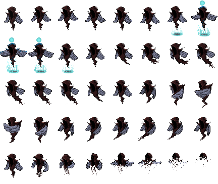

.. |folder| image:: assets/structure/folder.png
.. |file| image:: assets/structure/file.png

Ghosts
******

File structure
--------------

The file sturcture for ghosts is simple:

|folder| ghosts

    |folder| your_ghost_name

               |file| load.lua

               |file| animation.png [you can name this whatever.]

.. note::
    The name of your ghosts as seen in playersMobs and saves will correspond to that of the folder name.

    So if you have a folder called Avictus, you can do loadGhost:byName(Avictus) to get the ghost.

    the loadGhost system is NOT case sensitive.

Animation
---------

.. note::
    The maximum dimensions for a single frame is 94 x 94, however this limit is not enforced but instead highly encouraged, ghosts above this resolution may escape the screen.

Here is the animation for Avictus:

|Avictus|

The animation is coded like this::

		local w,h = RCToWH(image,5,8)
		-- we have 5 Rows and 8 columns, hence we divide the image by those values using the convenient RCtoWH function.

		states = {
			{
				name = "run",
				anim = {w,h,0.14,13,15}, -- from frame 13 to 15.
			},
			{
				name = "attack",
				anim = {w,h,0.09,20,26}, -- from frame 20 to 26
			},
			{
				name = "death",
				anim = {w,h,0.09,33,40}, -- from frame 33 - 40
			},
			{
				name = "cast",
				anim = {w,h,0.14,6,12}, -- from frame 6 to 12
			},
			{
				name = "idle",
				anim = {w,h,0.14,1,6}, -- from frame 1 to 6
			},
		},

.. note::
    Animations accept Delay as their parameter, to convert this to FPS use 1/fps, for example if you want your animation at 30 fps you do 1/30 for delay.

States
======
As you may have noticed animations are divided into states with respective names, there are the following states:

*run* When you move about.

*attack* When you attack.

*death* When you die.

*cast* When you cast a spell.

*idle* When you remain still.

*x_change* When you change direction.

.. note::
    You may see a *func* variable as part of the states, this is currently work in progress to allow for CG when drawing the state, but its going to change to allow for `update` and `draw`,

Characteristics
---------------
All of the characteristics are kept within the *info* table:

**Example**::

    name = "Avictus",	-- Name on card
    maxHp = 100,	--	100 or higher
    maxMp = 100, -- 100 or higher
    -- Below all stats can go up to 100
    def = 5, -- defence
    atk = 10, -- attack
    luck = 10, -- the lower the luck the higher the chance of capture.
    level = 3, -- the initial level.
    sourceCrystal = "player", -- the source of the mob, you can leave this empty, currently it doesn't do anything.
    stillFrame = 1, -- the frame that shows up when you see the VS screen before battle.
    story = "A guardian of sorts", -- The story
    rarity = 4, --super common 1 to 10 is rareness (how hard it is to capture) try to keep a good economy here, eg 1 = 30%, 2 = 25%.3 = 15%,4 = 10%,5 = 7%,6 = 5%, 7 = 3%, 8 = 2.5% , 9 = 1.5%, 10 = 1%
    element = "divine", -- The element that shows up on the card when you capture it/buy it.

    weak = { -- is weak to, takes more damage from.
        "fire",
        "attack",
    },
    strong = { -- takes less damage from.
        "divine",
    },
    invin = { 		--Invincibility, you don't lose a heart with this
        "dark",
    },

Elements
========
The elements available are:

*attack*

*fire*

*water*

*ice*

*wind*

*divine*

*dark*

The following types are for healing or restoring mp

*heal*

*restore*

Attacking
---------
You may want your Ghost to attack the opposite team, not just with the usually physical attack but instead via *Skills* to do this you need to script a skill.

This process can be easy or challenging, so please consider it carefully when designing a mob.

**Example**::

        skills = {
        {
            name = "Curse",
            desc = "Curse[10 ATK] a target for 3 turns",
            cost = 25,
            -- damage is used for the AI, in this case it should be 10*3 so 30.

            damage = 0,

            type = "dark",

            target = "foe",  -- targets: fTeam, team, self, friend, foe

            func = function(target,stack) -- Target is enemy -- tables is the damage meter -- stack: {self, team1, team2, finished}
                local mob = stack[1]
                mob:cast()
                -- On Cast is called when the cast animation is finished.
                mob.OnCast = function()
                    local no = 3
                    local i = 0
                    target.effect = "curse"
                    -- in this case we set the effect to "curse", and we damage the enemy for 3 turns.
                    target.OnChangeTurn = function()
                        local dmg = 10
                        local type = "dark"
                        if i >= 3 then
                            target.effect = nil
                            target.OnChangeTurn = nil
                        end
                        i = i + 1
                        return dmg,type
                    end

                    -- this is where we say that we finished the skill and we should hand the control back to the player.

                    stack[4] = true
                    mob.OnCast = nil
                end
            end,

        }

.. note::
    I am planning to include CG hooks to this, so you can draw fancy stuff as part of skills.

Effects
=======
Effects on their own do not do anything, so instead please apply damage yourself.

Here are the types of effects:

*poison*

*fire*

*curse*

*drown*

Healing
-------

Healing is little to no different than Attacking.

**Example**::

    {
        name = "Heal",
        desc = "Heals [50%] of current HP of the target.",
        cost = 45,
        damage = 0,
        type = "heal",
        target = "friend",

        func = function(target,stack)
            local mob = stack[1]
            mob:cast()
            mob.OnCast = function()
                target:applyDamage((target.hp/100)*50,"heal")
                stack[4] = true
                mob.OnCast = nil
            end
        end,

    },

Play mode
---------
Adjustments for play mode are made automaticaly, a physics shape is generated based on the size of your frame, this means that the bigger the frame the larger the shape so please take that in consideration.

If you make your frame too large then the ghost may find it difficult to move about or glitch, that is if you exceed 94 x 94 soft limit.

Using your ghost
================
To use your ghost you can use the NPC module and set the NPC name to that of your ghost.

Then place Yume and start the game, the AI should find its way towards you.

The AI is fairly basic but it will attempt some dangerous jumps so please be vary of it.

If you want to set the team yourself then use the save for the Skirmish mode as placed in the real house of the erisIntro level.

After note
----------
Some parts of the Ghost system are still under construction but the syntax of further builds is likely not to break backward compatibility.
