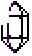

.. Lucidity documentation master file, created by
   sphinx-quickstart on Mon Dec 14 19:42:44 2015.
   You can adapt this file completely to your liking, but it should at least
   contain the root `toctree` directive.

Lucidity
========

Lucidity is an asymmetric game, combining platforming and turn based strategy.

Below is the documentation directed towards developers or enthusiasts willing to create maps and modules for lucidity.

Contents:
*********
.. toctree::
   :maxdepth: 2

   globals
   mapping
   states
   cards
   ghosts
   inbuilt
   modules
   assets

Indices and tables
==================

* :ref:`genindex`
* :ref:`search`

