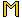
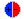
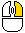
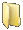

.. |lock| image:: assets/editor/lock.png

.. |file| image:: assets/structure/file.png

Map making
**********
You can produce maps for lucidity through the editor.

This guide will help you to create your first map.

A tutorial video is in production.

Basic controls
--------------

You can move using the W A S D keys and |scroll| to zoom,

Alternatively use the |scale| button with either |left_click| to zoom in and |right_click| to zoom out.

Use the |grid| icon or the G key to toggle grid.

Use the |ruler| icon or the R key to toggle ruler

You can move the mouse to the sides to the screen to drag it around, RTS style.

If you do not like this use the |lock| icon to prevent it.

Layers
------

The very basic principle of all maps of shapes and sizes is its layers.

Layers are a way to present depth and draw things atop and before the player.

To view your active layers go to the Editor from the main menu and click the |layers| at bottom right

You will see one new layer colored in blue. Layers are color coded depending on what they do.

Colors
======

Here is a table of colors and their meanings:

+----------+--------------+
| Color    |Meaning       |
+==========+==============+
| Blue     | Has colision |
+----------+--------------+
| Gray     | None         |
+----------+--------------+

More will be added as complexity of map making increases.

Layer dialog
============

**What are those other buttons?**

*UP* a layer, it moves a layer by one step.

*N* ew, makes a new layer above the current layer.

*M* erge, WIP doesn't work yet.

*D* elete, deletes a layer.

*P* roperties, views the properties of current layer:
::

 Name: [Layer 1]
 Mod X:     [0] Used for parallax, this is an offset based on camera position
 Mod Y:     [0] Used for parallax, this is an offset based on camera position
 Colision:  [on/off] indicates that shapes on this layer will have physics shapes
 Sound:     [on/off] Note:work in progress
 Transp:    [255] Transparency of the layer.

When you are finished press the Apply button otherwise swap to another layer or close the layers dialog.

*DOWN* a layer, it moves a layer down by one step.

Where to next?
==============

Press the  *N*  button to create a new layer.

This layer will be your current layer, everything that you create will be placed on this layer unless you select another one.

So now we know about layers so lets move onto placing things in them.

Shapes
------

To access to shapes take a look at the Dock at the bottom center of the window, you should see the following icons:
|modules| |selection| |rectangle| |circle| |polygon| |text| |scale|

Rectangle
=========
Rectangles are fairly simple, press on the |rectangle| icon and then |left_click| drag on the map and you should see a white rectangle form between the two points

Once you let go of the mouse the |rectangle| will be finalised, however you can continue making rectangles until you |right_click|

Circle
======
Circles are simple too, press on the |circle| icon and then |left_click| drag on the map, it will make a circle from the mouse click.

Polygon
=======
Polygons are a little more complex, to create one click on the |polygon| icon and then |left_click| to place a point.

To move a point use  |middle_click| to set it into the "Edit" mode and move the points around, when you are done press |middle_click| again.

To cancel the creation press |right_click| however to finish the process make a cycle by clicking on the last point to form a cycle.

.. note::
    The colors of the points change depending on what you are doing, for example selected point will be yellow.

    If the polygon intersects then the whole shape will turn red so make sure it doesn't or you wont be able to form a cycle.

    Both convex and concave polygons are supported.

Shape properties
================

**Go ahead and make one or two of the shapes you like, I recommend a simple rectangle**

At this point you may wonder how we can change the mundane white color to something more interesting.

Place your mouse atop of the rectangle until its edges turn red and |right_click|

A menu should pop up::

 Change color
 Set texture
 Delete
 Set Layer
 Add Trigger
 Remove Trigger
 Properties

Press the Change color button to open a new dialog where you can change the color

Currently it is in text to rgb mode only so input the color like such: r,g,b,a

For red do:

255,0,0

Transparency works too, just try:

255,0,0,100

Now open the layer dialog from before and select the layer beneath the one we were working in.

Create a few new shapes atop of our old ones, afterwards play with the layers to see how they work I recommend that you move the layers up and down or even try parallax!

Textures
========
As you have noticed the rectangle has an option to Set Texture, this is done from the Image interface that gets its images from various spritesheets.

The sprite will continuously wrap alongside the size of the shape in both X and Y axis.

Setting a texture will allow you to either mirror or reflect the texture, clicking on Set Texture again will remove the current texture.

SpriteSheets
------------

Spritesheets are complex however really convenient once you figure it out so I will try to keep it a simple as possible.

Before we do anything give the map a name and save it, if you pressed CTRL-S it will save it as New-<date><time>

To save the game press the "--------" button to open up the drop down menu and go File -> save or CTRL-S

Now open the map directory through Map -> Open dir , this should automatically open the map directory.

Navigate your way to the "Image" folder and add your texture/spritesheet there,  PNG is recommended.

Now go back to Lucidity and go sprites -> New, this will open a menu with two lists, the first list is images in resources the other is images in our map
 please select the name of the image you placed there.

A new dialog will open with the following items:

Properties, Image preview with selection, list of sprites from this image and preview of the sprite.

To create a sprite you can use the properties window or the preview by dragging a square and moving it to the desired position.

.. note::
    To create animations use the properties window to type out the properties of the animation(delay,(frame)start,(frame)finish) and when you hit *make* it will produce the animation in the preview.

Assign the sprite a name and then press *Add*, this will add the new sprite into the sprite list.

Once you are done press *Save*

Images
------
Okay so now we have made a sprite sheet, lets create some cool images, press the |image| button.

Press on the name of your map and select the name of your spritesheet, you will see the sprites drawn there, |left_click| on one to place them on the map.
|left_click| again to finish placement, now you can move it around like anything else.

You may want to play around with this and try applying a sprite as texture on some shapes to see how it works.

Selection tool
--------------
The selection tool is different from the other selection tools you have seen around, the main difference is that you can have as many of them as you want at the same time.

Press |selection| and |left_click| drag a square the same way you create rectangles, but make sure that you are on the same layer that the items you want to select.

Release |left_click| and move the selection about, you may see that the selection causes the shapes to become out of shape, I recommend using the *lock* option from its *Menu*
this option will lock the selection to grid.

Once you are happy with the changes you have made select the *Clear* option to remove the selection.

.. note::
    Selection rectangles are NOT saved.

Text
----
Text is the fastest way to deliver information, please use the Text tool to create it.

The text tool will automatically adjust to its size, so if you make additional spaces then the shape will be larger, the longer the text the longer the box.
To edit the text use the Set text option, the dialog has options for;

color, font name,font size,text.

.. note::
    Rich text is not implemented so please use fonts such as uniBody_italic and so on as your font.
    Fonts can be found in your_map/fonts/ [work in progress.] or define it in a script file as
    _G[font_name] = love.graphics.newFont(location)

.. _FileStructure:

File structure
--------------
Okay so here the serious stuff comes in, if you were uncomfortable with the previous parts I recommend that you revisit them before continuing.

The map has the following structure:

|folder| Map_name

   |folder| children

   |folder| image

   |folder| modules

   |folder| sounds

   |folder| spritesheets

   |folder| [optional] ghosts

   |folder| [optional] cards

   |file| general

   |file| layers

   |file| misc

   |file| mod

   |file| random

   |file| text

   |file| [optional] skybox.png

Modules
=======

Modules go here with the following structure:

|folder| Module name

    |file| src.lua

    other module specific files go here

    |folder| derivatives

        |folder| derivative_name

            |file| src.lua

            other derivative specific files go here.

Resources
=========
Okay so the resources are rather simple, it contains all the resources.

This includes modules, images, spritesheets,skyboxes,sounds

place all of your resources at *%appdata%/Lucidity/resources* for global use across maps.

Children
========

Children are one of the most important parts of the mapping process, it is responsible for saving space and resources and presistent gameplay.

Use the Zdoor derivative under the Station Module to automatically link and copy children.

To manually add a child map just copy a map to the *your_map/children* folder from your parent map.

.. note::
    All of the resources between the child and parent are shared however if you keep any resources in the child map they will not be removed.
    So to properly create a child map make a blank map, and move it to *chilren* folder and then right click on your parent map in the *file -> load* menu and select your map.

    Children can be added recursively!

Triggers and scripts
--------------------

All items, except some rare cases, have triggers multiple triggers available, these are events that are triggered based on a condition.
You can attach a trigger to a shape by |right_click| on it and *Add Trigger* then you will see an input box for code, you can type short scripts here.

It is highly inconvenient to use the in-game text editor I highly recommend to make a script file and place your scripts there to do this write a short script like this:
::

 --The global table of the Gamestate is named _G in this case so you must define things in the _G table
 --Otherwise the global variables are local, this means that you dont need to use Local and you wont interfere with the globals.

 _G["HelloWorld"] = function()
    print("Hello world")
 end

Save this as *myscripts.lua* in the *your_folder/scripts/* folder,and press the *Utilities -> Reload scripts* button, check the console for errors!
Now attach this script to a shape by *Add trigger* by typing HelloWorld() in the script menu and pressing *Apply*

Each of the triggers have different global variables returned from events and properties:
::

 Player-in      none
 Player-out     none
 Hplayer-in     none
 Hplayer-out    none
 Load           none
 Draw           bool debug mode
 Update         float dt [delta time]

All of the triggers will have the *self* variable defined as the shape the trigger is called on.

The collision based events will require that you return *true* to continue executing after the player has colided, otherwise it will be a *Once only* event
Pointers
========

To point at an object you need to assign it a name first, to do that:

|right_click| on the object and *properties* then input a name and press *done*

This will add the item to the global table that you can access through scripts.

Modules
-------
Modules are a complex subject so I have assigned a large category to this and programing then so if thats what you are looking for please visit: <link>

To place a module use the |modules|, this is a similar dialogue as that of the images so you can use it the same way.

Once you find the module you want select it and then its derivative, for example to make player you have to select:

Your_map -> Player -> Yume

This will create Yume, which is a derivative of Player.

.. note::
    Each of the modules have their own settings and their own way of doing things so please refer to the developers documentation on how to use them.

So to finish off this tutorial create Yume and place her in the middle of the map and press *file->run* to play the map.

Skybox
------

Skyboxes are a rather simple implementation, you place the skybox.png in your map folder and then *Utilities -> skybox* and this will set the skybox.

if you want an ambient color instead of a skybox use *Utilities -> Ambient color* and type the color out.

Scenes
------

Scenes are a different beast but operate on the same editor, the main difference is that they have a viewing range.

I calculated the maximum space that the scene can take and created simple placements of the sky and ground of the scene with Green and Blue respectively.

You can operate them like shapes and set texture to them but you cannot erase them.

There is a pedestal for each of the teams captains marked with a shape of its own, please use that to set an image for the pedestal.

Otherwise it is no different, please use the layers carefully though and make sure not to place things on the ground where the ghosts walk, they might trip.

Additional help
---------------

You may require additional help so you can contact me on Lucidity's forums at <link>