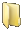
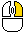
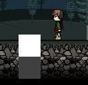
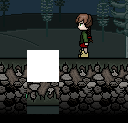
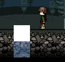
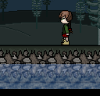
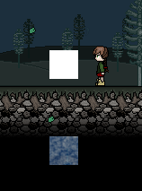

.. |modules| image:: assets/editor/modules.png

Modules
*******

The module system is made to facilitate large constructs for complex systems to be installed in the game.

If your idea is not complex then I'd highly encourage you to use scripts instead.

Creating
--------
To create a module we must first create a file structure.

Our working directory will be a brand new map. We will start in **your_map/modules/**

I am going to create water so here is how I am going to do it.

We need to create:

|folder| Liquid

    |file| src.lua

    |folder| derivatives

        |folder| Water

            |file| src.lua

        |folder| Lava

            |file| src.lua

        |folder| Acid

            |file| src.lua

I will focus on creating the Module **Liquid** and the derivative **Water**

Module
======
The Water module is fairly easy to build, **src.lua** is our main component and will be scanned when loading modules.

Here are the functions that we need to define first::

 liquid = {}

 function liquid:new(gamestate,colider,phyWorld,x,y,width,height)
    local self = {
        x = x or 0,
        y = y or 0,
        zmap = gamestate.current_zmap,
        width = width or 32,
        height = height or 32,
        parent = gamestate,
        type = "liquid"
        Collider = colider,
    }

    setmetatable(self,{__index = liquid})
    self:makeColision()

    return self
 end
 function liquid:makeColision()
    local Collider = self.colider
    local x,y = self.x,self.y
    local w,h = self.width,self.height

    if self.colision then
        Collider:remove(self.colision)
    end
    self.colision = Collider:addRectangle(x,y,w,h)

    function self.colision.getUserData() -- this is required for identification
        return {source = self,part = "main"}
    end

    if self.OnMakeColision then -- this is necessary!
        self.OnMakeColision(self.colision)
    end

 end
 function liquid:getColision()
    return self.colision
 end

 function liquid:update(dt)
    -- this part is optional

        local w,h = (self.width)/2,(self.height)/2
        self.topX,self.topY = incrementPos(self.x,self.y,w,h)
        if not self.Free then
            self.dx = self.topX + (self.modx or 0)
            self.dy = self.topY + (self.mody or 0)
        else
            self.dx = nil
            self.dy = nil
            end

    -- end of optional

    self.colision:moveTo(self.dx or self.x,self.dy or self.y)
 end

 function liquid:draw(debug)
    if debug then
        setColor(colors.yellow)
        self.colision:draw("line")
        setColor()
    end
 end

 function liquid:save()
    local t = {
        x = self.x,
        y = self.y,
        z = self.zmap,
        w = self.width,
        h = self.height,
    }
    return t
 end

 function liquid:load(table)
    self.x = table.x
    self.y = table.y
    self.zmap = table.zmap
    self.width = table.width
    self.height = table.height
 end

 function liquid:remove()
    self.Collider:remove(self.colision)

 end

These are all the mandatory functions, you must define them for each one of your modules.

To make a water effect I decided to split our work in 3 sections.

1. **Get the reflection of the block above.**

 |demo1|

.. note::
    White = new tile
    Gray = the new position.

At `liquid:new` ::

 self = {
    ...
    ...
    canvas = love.graphics.newCanvas(32,32)
 }

At `liquid:makeColision` ::

    canvas = love.graphics.newCanvas(w,h)

At `liquid:update` ::

  local game = Gamestate.current()
  local mainCanvas = game.mainCanvas
  local lg = love.graphics

  local w,h = self.width,self.height
  local upx,upy = game.cameraBox:bbox() -- the left top position of the camera.

  local cx,cy = self.x or self.dx,self.x or self.dy -- our position

  -- we need to find the new coordinates

  cy = cy + h
  -- we plan to reflect the top of our tile so we add height parameter to our y position.

  -- now we need to find the difference between the two and translate the new tile to the top.
  local tx = cx - upx
  local ty = cy - upy

  -- I didn't use the findDistance as our numbers may be negative in some cases, findDistance gives you only absolutes.
  -- now the new tile will be drawn at [0,0] of our new canvas.
  lg.setCanvas(self.canvas)
    lg.push()
    lg.translate(tx,ty)
    lg.draw(mainCanvas)
    lg.pop()
  lg.setCanvas()

|demo2|

2. **Flip the reflection and place it at our block.**

At `liquid:draw` ::

 local x,y = self.colision:bbox() -- bbox gives our top cordinates

 -- we need to make a reflection so we need to pass -1 as our y-scale.
 -- we want to scale it around the center hence we pass width and height halfed as our offsets.

 love.graphics.draw(self.canvas,x,y,0,1,-1,self.width/2,self.height/2)

3. **Add a water effect from shader.**

 At `liquid:update` ::

  ...
  ...
   lg.setCanvas(self.canvas)

    ...

    if self.shader then
        lg.setShader(self.shader)
    end

    lg.draw(mainCanvas)

    ...

 If we coded our shader properly it should now look like this:

 |demo3|

    Here's how our final render should look like when applied across a larger field.

 |demo4|

**Expanding the module**

We may need to expand the module to allow for more features, for example we may want to copy a tile at a different position so we could asign a factor.

This is our expected result:

|demo5|

At this point it is obvious that we need a few more functions::

 function liquid:setFactor(factor)
    self.factor = factor
 end
 -- and
 function liquid:setShader(shader)
    self.shader = shader
 end
 -- also
 function liquid:setSize(w,h)
    self.width = w
    self.height = h
    self:makeColision()
 end

We will also need to make a small incision

At `liquid:update` ::

 ...

 cy = cy + h *(self.factor or 1)

 ...

Derivative
==========
Now we have a module running we need to make a derivative, in this case we will make Water.
to do this we will create a

|folder| Water

*at /my_map/modules/liquids/*

in this folder we will place:

|file| water.glsl

|file| src.lua

In *src.lua* we will place the following code::

 local derivative = {}
 local shader

 function derivative:new(module,dir,gamestate,colider,phyWorld,x,y)
    if not shader then shader = love.graphics.newShader(dir.."/water.glsl")

    local instance = module:new(gamestate,colider,phyWorld,x,y)

    instance:setShader(shader)

    return instance

 end

 return derivative

I will let you code *water.glsl* on your own as I am not proficient enough at GLSL at the moment.

If you are kind enough then please get me `The Orange Book <http://www.amazon.com/dp/0321637631/>`_, on my amazon wish list (when I have it up).

This will surely get me up to speed with GLSL.

Using
-----
We finally managed to reach the point at which we start to use our module.

To place the module on the map use the |modules| and find it.

.. note::
    If you cannot find the module then you failed the file structure test.

When you have placed your module |right_click| it and a menu will pop up with the following:

`Delete`

`Add Trigger`

`Remove Trigger`

`Set Layer`

`Properties`

To add more to this menu use the :func:`<module>OnMenu`

Dependencies
------------
Some derivatives might need dependencies, for example the *Elevator*'s *helevator* derivative needs the *Door* module

To do this you need to define a few functions in *Elevator/helevator/src.lua* ::

 local der = {}
 function der:new(...)

 ...

    local door_der = self.dep[1].derivative
    local door_mod = self.dep[1].module
    local door_dir = self.dep[1].der_dir

    local door = door_der:new(door_mod,door_dir,mode,colider,phyWorld)

 ...

 end
 end

 function der:getDependencies()
    local d = {}
    local dep = {module = "door",derivative = "elevator_door"} -- search for Module: door, derivative: elevator_door
    table.insert(d,dep)
    return d
 end

 function der:setDependencies(d)
    self.dep = d
 end

So this derivative needs the *Door* module which must have *elevator_door* derivative.

**!!** Beware of `Circular <https://en.wikipedia.org/wiki/Circular_dependency>`_ dependencies **!!**

Available functions
-------------------
Module
======

Necessary
+++++++++

.. function:: <module>:new(gamestate,colider,phyWorld,x,y)

    :param gamestate: the gamestate the derivative was created in.

    :param coluder: active HardonColider instance.

    :param phyWorld: physics world (Box2D)

    :param numbers x,y: positions.

    :returns: module

.. function:: <module>:makeColision()

.. function:: <module>:update(dt)

.. function:: <module>:draw(debug)

    :param bool debug: debug mode.

.. function:: <module>:save()

    :returns table: of data.

.. function:: <module>:load(table)

    :param table: the table of data returned from :func:`<module>:save`

.. function:: <module>:remove()

Optional
++++++++

.. function:: <module>:OnMenu(menu,ui)

    :param ui_item menu: the Menu.

    :param ui_package ui: The UI package currently active.

.. function:: <module>:OnRightClick(ui,menu)

    :param ui_item menu: the Menu.

    :param ui_package ui: The UI package currently active.

.. function:: <module>:OnLoseFocus()

Derivative
==========

Necessary
+++++++++

.. function:: <derivative>:new(module,dir,gamestate,colider,phyWorld,x,y)

    :param module: the module instance

    :param dir: the source directory

    :param gamestate: the gamestate the derivative was created in.

    :param coluder: active HardonColider instance.

    :param phyWorld: physics world (Box2D)

    :param numbers x,y: positions.

    :returns: instance

Optional
++++++++

.. function:: <derivative>:getDependencies()

    :returns table: {module = string, derivative = string}

.. function:: <derivative>:setDependencies(d)

    :param table d:

Stock
-----

There are a number of stock modules but I will not document them here, they are fully open source so you can read them yourself.

They are located under *resources/modules/*
